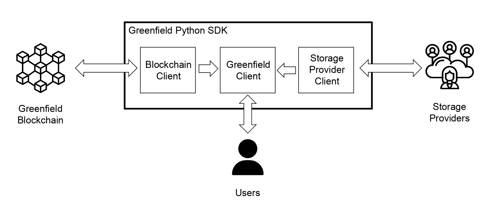

# Under the Hood of the Greenfield Python SDK: A Technical Breakdown

While conceptualizing the architecture of the Python SDK, we realized the importance of connecting it to both the Blockchain and the Storage Providers. These connections are crucial for managing the basic and essential tasks required for users to interact with Greenfield effectively.

From this idea, we decided to create 3 different clients:
- **Blockchain Client**: This client would be used to make all the different requests to the Blockchain;
- **Storage Provider Client**: This client would be used to connect the user to the active Storage Providers;
- **Greenfield Client**: This client is a compound of the two previous clients. It would be used by the users to make basic actions on the greenfield environment like creating buckets or groups.



We agreed to write all the client code in the main folder called `./greenfield_python_sdk`. For the dependency management, we have chosen to use Poetry, which is a robust and convenient tool. 

This approach helped us to effectively organize and develop the SDK. Here is a quick overview of the different folders in the project:
```
.
├── examples
├── greenfield_python_sdk
├── proto
└── tests
```

# Blockchain Client

## Why do we use a Blockchain Client?

The Blockchain is a fork of the Cosmos SDK project, and all requests to the Blockchain are made using gRPC (Remote Procedure Call). gRPC, developed by Google, is a high-performance RPC framework. gRPC requests utilize Protocol Buffers (Protobuf). It enables you to define service structure and data exchange using Protobuf, which then generates client and server code in multiple programming languages. Protobuf files, `.proto`, define the Protocol Buffers used in the Cosmos SDK.

The Cosmos SDK uses two types of Protobuf files: `Tendermint` and `Amino`. The Blockchain Client handles the gRPC requests and routes them over the RPC of `Tendermint`.

## What is Tendermint and Amino?

The Greenfield Blockchain is derived from the Cosmos Blockchain, which utilizes the Cosmos SDK, a modular and open-source framework for developing Blockchain applications and custom Blockchains. The Cosmos SDK leverages the `Tendermint` Consensus to enable nodes to achieve consensus on transaction order and validity in a deterministic and decentralized manner. This consensus mechanism is similar to a BFT (Byzantine Fault Tolerance) consensus.

In `Tendermint`, consensus is reached through a set of validators, also known as block producers. Validators take turns proposing new blocks and voting on them. The validator set is selected through a governance process or other mechanisms, and validators are incentivized to act honestly through economic incentives.

The `Tendermint` protobuf files are used to retrieve information about the Blockchain status, such as obtaining the Block ID. Additionally, the `Amino` object encoding specification is used as a binary wire encoding protocol in Cosmos.

**Note**: For more information about `Tendermint`: [what is Tendermint](https://docs.tendermint.com/v0.34/introduction/what-is-tendermint.html).

## Cosmos and Greenfield Requests

Atop these two Protobufs, we have two other types of gRPC requests: `Cosmos SDK` and `Greenfield`.

The `Cosmos SDK`'s gRPC requests are employed to execute actions in the Blockchain, such as managing accounts or transactions. It uses some of the `Tendermint`'s types.

On the other hand, the `Greenfield` gRPC requests are used to perform various actions within the environment. 

Let's briefly recap what `Greenfield` is all about:
Within the broader BNB Chain ecosystem, `BNB Greenfield` provides a decentralized storage infrastructure, allowing users and decentralized applications to create, store, and exchange data with complete ownership. This establishes a new data-driven economy, empowering all participants in the BNB Chain ecosystem to possess, utilize, and monetize data.

`BNB Greenfield` serves as a storage-focused Blockchain, that interacts with a decentralized network of storage providers (SPs). Users can upload their data with unique access and usage permissions. The SPs store the data off-chain with proper redundancy and backup, while metadata of users' BNB ledger is stored on the `BNB Greenfield` Blockchain.

In this context, `Greenfield` gRPC requests are utilized to achieve different actions like creating and managing buckets, challenging storage providers, and more.

## How are Protos files used?

With this overview of the available requests, let's discuss on how protobuf files are used.

To begin, we organized all the necessary protobuf files in the directory `./proto`. Since we needed to work with these protobuf files, we chose to use the `BetterProto` library to automatically generate the related Python files from these protobufs. This library assists in generating asynchronous functions that send gRPC requests and handle the objects within the protobuf files.

## Transaction Messages

As the Blockchain client is in connected to the Blockchain, we also use it to send a transaction. In this case, we have to use a REST API request to do so.

Before sending a transaction to the Blockchain, we need to create a transaction message, which consists of three parts: the **body**, the **authinfo**, and the **signature**.

The **body** contains the endpoint to which the transaction is sent, and the content that is converted to bytes.

The **authinfo** includes the signer information and the transaction fee.

To prepare the **body** and **authinfo**, you can refer to the function `build_tx` in the file `./greenfield_python_sdk/blockchain_client.py`, which can be found [here](https://github.com/bnb-chain/greenfield-python-sdk/blob/main/greenfield_python_sdk/blockchain_client.py#L79):
```python
async def build_tx(
        self,
        message,
        type_url: str,
        fee: Optional[Fee] = None,
    ) -> Tx:
        if not self.key_manager:
            raise KeyError("To build txs you need to add a key_manager to the BlockchainClient")

        if not fee:
            fee = Fee(
                amount=[Coin(denom="BNB", amount="10000000000000")],
                gas_limit=2000,
                payer=self.key_manager.address,
            )
        if type_url == CREATE_BUCKET or type_url == CREATE_OBJECT:
            sp_approval = base64.b64decode(message.primary_sp_approval.sig)
            message.primary_sp_approval.sig = bytes(sp_approval)

        wrapped_message = AnyMessage(
            type_url=type_url,
            value=bytes(message),
        )

        body = TxBody(messages=[wrapped_message])
        auth_info = AuthInfo(
            signer_infos=[
                SignerInfo(
                    public_key=AnyMessage(
                        type_url="/cosmos.crypto.eth.ethsecp256k1.PubKey",
                        value=bytes(PubKey(key=self.key_manager.account.public_key)),
                    ),
                    mode_info=ModeInfo(single=ModeInfoSingle(mode=SignMode.SIGN_MODE_EIP_712)),
                    sequence=self.key_manager.account.next_sequence,
                )
            ],
            fee=fee,
        )

        tx = Tx(
            body=body,
            auth_info=auth_info,
            signatures=[b""],
        )

        return tx
```

The **signature** of the message follows the EIP712 protocol.

Before signing the message, we need to prepare the pre-signed message following a specific design. The content of the object is formatted according to the object's arguments and their types. Additional data, such as `Coin`, `EIP712Domain`, `Fee`, or`Tx` is also included in the pre-signed message.

Once the pre-signed message is ready, it undergoes multiple compressions and hashing using the `keccak` function. The final result is then signed using the user's private key and added to the transaction message.

**Note**: For more information about the EIP712 protocol, you can check out this [link](https://eips.ethereum.org/EIPS/eip-712).


## Location of the Blockchain Client components

To organize the protobuf files, we created a folder named `proto`, where you can find the `Amino`, `Cosmos`, `Greenfield`, and `Tendermint` protobuf files. You can access these files [here](https://github.com/bnb-chain/greenfield-python-sdk/blob/main/proto).

The generated Python files from the protobuf files are stored in the `./greenfield_python_sdk/protos directory`, and you can find them [here](https://github.com/bnb-chain/greenfield-python-sdk/blob/main/greenfield_python_sdk/protos).

To handle the different endpoints and make requests to them, we've created various functions directly linked to the protobuf-generated Python files. These functions are accessed through the Blockchain Client, which is the main connector. You can find the Blockchain Client in the file `./greenfield_python_sdk/blockchain_client.py`, and it's available [here](https://github.com/bnb-chain/greenfield-python-sdk/blob/main/greenfield_python_sdk/blockchain_client.py).

You can also find the different functions to send a transaction in the `./greenfield_python_sdk/blockchain_client.py` and in the file `./greenfield_python_sdk/sign_utils.py` that you can find [here](https://github.com/bnb-chain/greenfield-python-sdk/blob/main/greenfield_python_sdk/sign_utils.py).

If you're interested in exploring the different types of gRPC requests you can perform with the Blockchain client, check out the `./greenfield_python_sdk/blockchain`directory [here](https://github.com/bnb-chain/greenfield-python-sdk/blob/main/greenfield_python_sdk/blockchain):
```
./greenfield_python_sdk/blockchain
├── _cosmos
│   ├── auth.py
│   ├── authz.py
│   ├── bank.py
│   ├── crosschain.py
│   ├── distribution.py
│   ├── evidence.py
│   ├── feegrant.py
│   ├── gov.py
│   ├── mint.py
│   ├── oracle.py
│   ├── params.py
│   ├── slashing.py
│   ├── staking.py
│   ├── tx.py
│   └── upgrade.py
├── bridge.py
├── challenge.py
├── cosmos.py
├── payment.py
├── permission.py
├── sp.py
├── storage.py
├── tendermint.py
├── utils.py
└── virtual_group.py
```


To understand the format for each transaction body's signature argument, you can refer to the folder `./greenfield_python_sdk/models/eip712_messages` in the Greenfield Python SDK repository. Inside this folder, you will find various sub-folders, each representing a different transaction body's format, such as `storage` that contains the transaction's body format to create buckets and objects, `bank` to send `BNB` tokens, and more. You can explore these sub-folders [here](https://github.com/bnb-chain/greenfield-python-sdk/blob/main/greenfield_python_sdk/models/eip712_messages):
```
./greenfield_python_sdk/models/eip712_messages/
├── authz
├── bank
├── challenge
├── crosschain
├── distribution
├── feegrant
├── gov
├── group
├── payment
├── proposal
├── slashing
├── sp
├── staking
└── storage
```

In addition to the transaction body, other data is also included in the pre-signed message. You can find this information in the file `./greenfield_python_sdk/models/eip712_messages/base.py`, which is available [here](https://github.com/bnb-chain/greenfield-python-sdk/blob/main/greenfield_python_sdk/models/eip712_messages/base.py):
```python
BASE_TYPES = {
    "Coin": [{"name": "amount", "type": "uint256"}, {"name": "denom", "type": "string"}],
    "EIP712Domain": [
        {"name": "chainId", "type": "uint256"},
        {"name": "name", "type": "string"},
        {"name": "salt", "type": "string"},
        {"name": "verifyingContract", "type": "string"},
        {"name": "version", "type": "string"},
    ],
    "Fee": [
        {"name": "amount", "type": "Coin[]"},
        {"name": "gas_limit", "type": "uint256"},
        {"name": "granter", "type": "string"},
        {"name": "payer", "type": "string"},
    ],
    "Tx": [
        {"name": "account_number", "type": "uint256"},
        {"name": "chain_id", "type": "uint256"},
        {"name": "fee", "type": "Fee"},
        {"name": "memo", "type": "string"},
        {"name": "msg1", "type": "Msg1"},
        {"name": "sequence", "type": "uint256"},
        {"name": "timeout_height", "type": "uint256"},
    ],
}
```


# Storage Provider Client

## Why do we use a Storage Provider Client?

One of the key tasks is to establish a connection between users and Storage Providers within the Greenfield environment. Storage Providers are responsible for storing user data. Since the object's body isn't stored in the Blockchain, specific rules and requests must be followed by users to create buckets and objects. Furthermore, users need to send the body of the object to the Storage Providers. This communication between users and Storage Providers is facilitated using `REST API` requests. For more details about these requests, you can refer to this [list](https://docs.bnbchain.org/greenfield-docs/docs/api/storage-provider-rest/get_approval) that outlines the different actions made using `REST API`.

To manage all these `REST API` requests efficiently, we have developed a Storage Provider Client.

## How the REST API requests are made?

The Storage Providers handle standard REST API requests, including both `GET` and `POST`, depending on the specific action. Additionally, certain headers are required in the Greenfield environment for each request.

Every request needs an `Authorization` header, which is generated by taking the relevant information from the `REST API` request and hashing it using the `sha256` function. The resulting hash is then further hashed with the `keccak` function. Here's the order in which the request is sorted before the hashing process:
```
Type of request (e.g., GET)
Subdirectory (e.g., /greenfield/admin/v1/get-approval)
List of headers (e.g., x-gnfd-unsigned-msg: ...)
Domain Name (e.g., gnfd-testnet-sp-2.bnbchain.org)
List Name of headers (e.g., x-gnfd-unsigned-msg)
```

To perform these requests, we utilize the `aiohttp` library, which is implemented in the file `./greenfield_python_sdk/storage_provider/request.py` ([Link](https://github.com/bnb-chain/greenfield-python-sdk/blob/main/greenfield_python_sdk/storage_provider/request.py)).


## Requests made via the Storage Provider Client

The requests made to the storage providers are related to the storage of data. There are two main types of requests: 
- Related to the Bucket
- Related to the Object

Both of these fields share similar requests. To create a bucket or an object, you need to get the approval of the storage provider before creating a transaction to seal the agreement in the Blockchain. In both cases, you need to send a request to get the approval. 

Specific to the object, for users to upload or download the object, they need to send a `REST API` request to the storage provider with either the body of the object to upload or the name of the object to download.

**Note**:
To obtain approval for creating an object, users must send the body data, which is compressed using an erasure code called Reed-Solomon. You can find more information on the Reed-Solomon erasure code [here](https://www.backblaze.com/blog/reed-solomon/).

The Greenfield team chose to utilize the Golang [`reedsolomon library`](https://github.com/klauspost/reedsolomon/tree/master). Since there is no equivalent Python library that reproduces a similar matrix Reed-Solomon approach, we developed a bridge code to interface with the Golang library. This bridge code converts Golang code to Python using the C language.

If you wish to create objects using the Python SDK, you'll need to include the generated `.so` or `.dll` file from the `data-redundancy-generator-bridge` repository ([link](https://github.com/bnb-chain/data-redundancy-generator-bridge)) in the `./greenfield_python_sdk/go_library` folder.

```
./greenfield_python_sdk/go_library/
└── main.so
```

Detailed instructions on how to generate the `.so` or `.dll` files are provided in the `README` file of the `data-redundancy-generator-bridge` repository.


## Other features in the Storage Provider Client

As the Storage Provider client is in charge of the `REST API` requests, we included other features that uses `REST API` requests. We added the request to get the "list of groups a user is a part of" in a file called `./greenfield_python_sdk/storage_provider/group` ([Link](https://github.com/bnb-chain/greenfield-python-sdk/blob/main/greenfield_python_sdk/storage_provider/group.py)).

Other files may be created in the future as there are new `REST API` requests added in each new version of the Greenfield environment.


## Location of the Storage Provider Client components

We decided to create a Client called Storage Provider that we wrote in the main folder `./greenfield_python_sdk/storage_client.py` that you can find [here](https://github.com/bnb-chain/greenfield-python-sdk/blob/main/greenfield_python_sdk/storage_client.py)

All the functions related to the Storage Provider client are saved in the folder `./greenfield_python_sdk/storage_provider` ([Link](https://github.com/bnb-chain/greenfield-python-sdk/tree/main/greenfield_python_sdk/storage_provider)). These are some of the different files in the folder:

```
./greenfield_python_sdk/storage_provider/
├── bucket.py
├── group.py
├── object.py
├── request.py
└── utils.py
```

# Greenfield Client

Now that the connection is made with the Blockchain and the storage providers, we can merge the functionnalities of both clients to apply real actions in the Greenfield environment. Indeed, some of the actions require making requests to both the Blockchain and the Storage Providers. For example, to create a bucket, you need to get the approval of the storage provider and then create a transaction in the Blockchain to seal the agreement.

Most of the functionnalities present in the Greenfield Go-SDK are present in the Greenfield Client. Useful functions to synchronize the user's account to the Blockchain are also added to this client.

## Location of the Greenfield Client components

The Greenfield Client code can be found in the file [`./greenfield_python_sdk/greenfield_client.py`](https://github.com/bnb-chain/greenfield-python-sdk/tree/main/greenfield_python_sdk/greenfield_client.py). You can explore the Greenfield Client and its functionalities in the folder `./greenfield_python_sdk/greenfield`, which contains 13 different files, each representing a specific feature. Here's a brief overview of the files in the folder ([Link](https://github.com/bnb-chain/greenfield-python-sdk/tree/main/greenfield_python_sdk/greenfield)):
```
./greenfield_python_sdk/greenfield
├── account.py
├── basic.py
├── bucket.py
├── challenge.py
├── crosschain.py
├── distribution.py
├── feegrant.py
├── group.py
├── object.py
├── payment.py
├── proposal.py
├── storage_provider.py
├── validator.py
└── virtual_group.py
```

Each of these files corresponds to a different feature of the Greenfield Client, such as managing accounts, buckets, challenges, cross-chain functionality, and more. You can explore the specific functionalities provided by each file to understand the complete capabilities of the Greenfield Client.

# Other Functions

In addition to the client files, there are also utility files in the Greenfield Python SDK, such as `./greenfield_python_sdk/config.py` and `./greenfield_python_sdk/key_manager.py`.

The `config.py` file is used to set the account used for making transactions or requests, as well as defining the endpoint to which users are connected.

On the other hand, the `key_manager.py` file is responsible for creating and managing `Accounts` and their public/private keys.

**Note**: For more information on the different endpoints, you can check out this [link](https://docs.bnbchain.org/greenfield-docs/docs/api/endpoints).


# Conclusion

The project, consisting of numerous files and folders, involves various types of requests such as gRPC and REST API. We have put in effort to make the code as clear as possible and organized it in a manner that is easy to comprehend. We hope this document has provided you with a better understanding of the different components of the Greenfield Python SDK.

We hope you enjoy using our SDK! It would be great if you could provide any feedback or issues. You can find the repository [here](https://github.com/bnb-chain/greenfield-python-sdk).
